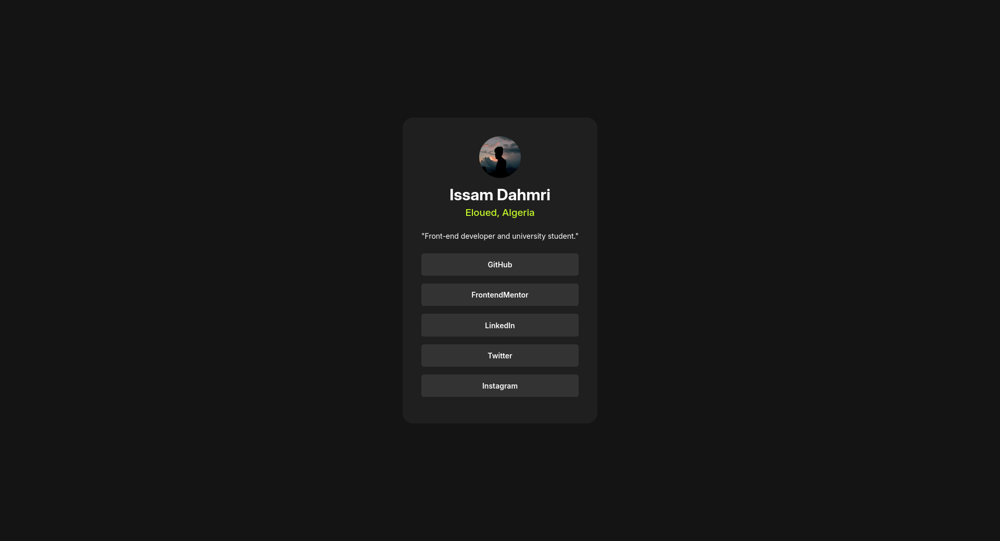

# Frontend Mentor - social links profile

This is a solution to the [social links profile challenge on Frontend Mentor](https://www.frontendmentor.io/challenges/social-links-profile-UG32l9m6dQ). Frontend Mentor challenges help you improve your coding skills by building realistic projects.

### Screenshot

### Links

- Solution URL: [solution URL](https://social-link-profile-frontend-mentor-kxcmenfm9.vercel.app/)

### Built with

- Semantic HTML5 markup
- CSS custom properties
- Flexbox

### What I learned

- CSS variable
- responsive design
- flexbox
